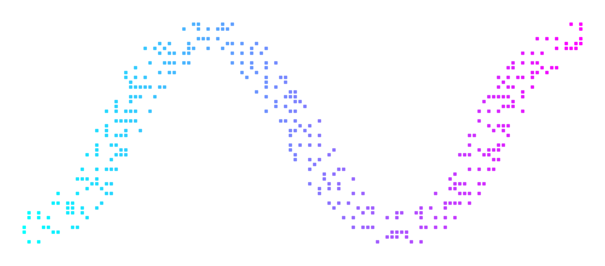

<div align="center">
<h1 align="center">

<br>LightWave-Server
</h1>
<h3>◦ LightWave: A High-Performance HTTP API for Addressable LEDs</h3>

<p align="center">


</p>
</div>

---

## 📍 Overview

LightWave-Server is a robust, asynchronous Python-based server designed for controlling ws281x (NeoPixel) LED strips. Built with **FastAPI** and **Adafruit Blinka**, it provides a high-performance RESTful API to manage LED states, brightness, and dynamic lighting effects.

The core features include a thread-safe LED controller, a plugin-based effect system with FPS normalization, and graceful transition management.

---

## ⚙️ Features

*   **RESTful API:** Control your LEDs via simple HTTP endpoints.
*   **Thread-Safe:** Robust locking mechanisms ensure safe hardware access from multiple requests.
*   **Plugin System:** Easily extendable effects library. Just drop a new effect class in `lib/effects/`.
*   **FPS Normalization:** Effects run at a consistent 60 FPS across different hardware.
*   **Graceful Transitions:** Smooth fade-out animations when stopping effects or shutting down.
*   **Parameterized Effects:** Configure effect speed, colors, and other parameters dynamically via the API.
*   **Hardware Support:** Designed for Raspberry Pi (using GPIO) but includes mock support for development.

---

## 🚀 Getting Started

### Hardware Requirements

*   **Raspberry Pi** (Zero, 3, 4, or 5 recommended)
*   **WS281x LED Strip** (NeoPixel)
*   **Power Supply** (Adequate for your specific LED count)
*   **Level Shifter** (Recommended: 3.3V to 5V for data line)

### 📦 Installation

1.  **Clone the Repository:**
    ```bash
    git clone https://github.com/target111/LightWave-Server.git
    cd LightWave-Server
    ```

2.  **Set up a Virtual Environment (Recommended):**
    ```bash
    python3 -m venv .venv
    source .venv/bin/activate
    ```

3.  **Install Dependencies:**
    ```bash
    pip install -r requirements.txt
    ```

### 🔧 Configuration

LightWave-Server uses environment variables for configuration. You can set these in your shell or a `.env` file (if you add `python-dotenv` support, otherwise export them).

| Variable    | Default | Description                                      |
| :---------- | :------ | :----------------------------------------------- |
| `LED_COUNT` | `300`   | The number of LEDs in your strip.                |
| `LED_PIN`   | `D18`   | The GPIO pin connected to the Data In line.      |

**Example:**
```bash
export LED_COUNT=150
export LED_PIN=D18
```

### 🎮 Running the Server

Start the server using `uvicorn`:

```bash
# For development (with auto-reload)
uvicorn main:app --host 0.0.0.0 --port 8000 --reload

# For production
uvicorn main:app --host 0.0.0.0 --port 8000
```

Once running, you can access the **Interactive API Documentation** at:
`http://<your-pi-ip>:8000/docs`

---

## 🔌 API Usage Examples

**1. List all available presets:**
```bash
curl -X GET http://localhost:8000/presets
```

**2. Start the 'MatrixRain' effect:**
```bash
curl -X POST http://localhost:8000/presets/start \
  -H "Content-Type: application/json" \
  -d '{"preset_name": "MatrixRain"}'
```

**3. Start 'RainbowCycle' with custom speed:**
```bash
curl -X POST http://localhost:8000/presets/start \
  -H "Content-Type: application/json" \
  -d '{"preset_name": "RainbowCycle", "args": {"speed": 2.5}}'
```

**4. Set a static color (Red):**
```bash
curl -X POST http://localhost:8000/leds/color/set \
  -H "Content-Type: application/json" \
  -d '{"color": "#FF0000"}'
```

**5. Stop current effect (fades out):**
```bash
curl -X POST http://localhost:8000/presets/stop
```

---

## 🛠 Development Guide

### Project Structure

```
LightWave-Server/
├── lib/
│   ├── effects/          # Effect plugins
│   │   ├── __init__.py
│   │   ├── aurora.py
│   │   └── ...
│   ├── config.py         # Configuration loader
│   ├── led.py            # Core LED controller & EffectBase
│   └── server.py         # FastAPI application routes
├── main.py               # Entry point
├── requirements.txt
└── README.md
```

### Creating a New Effect

1.  Create a new file in `lib/effects/`, e.g., `my_effect.py`.
2.  Inherit from `EffectBase` and implement `tick()`.
3.  Use `self.led.set_pixel(i, (r, g, b))` to draw.
4.  Use `self.config` to access arguments passed from the API.

**Example Template:**

```python
from lib.led import EffectBase

class MyCustomEffect(EffectBase):
    """
    A description of your effect (shows up in API).
    """
    def __init__(self, led, **kwargs):
        super().__init__(led, **kwargs)
        # Initialize state here
        self.color = self.config.get('color', (255, 0, 0))

    def tick(self):
        # This runs at 60 FPS
        # Update your animation state here
        for i in range(self.led.count):
             self.led.set_pixel(i, self.color)
```

---

## ✅ TODOs & Roadmap

- [ ] **Web UI:** Develop a simple React/Vue frontend to control the server without using curl/Postman.
- [ ] **Music Reactivity:** Integrate microphone input (FFT) to make effects react to music.
- [ ] **Persisted Settings:** Save the last running state/config to disk so it resumes on reboot.
- [ ] **Docker Support:** Containerize the application for easier deployment.
- [ ] **Unit Tests:** Add tests for API endpoints and logic (mocking the hardware).
- [ ] **Effect Previews:** Generate a preview (GIF/WebP) for effects in the UI.

---

## 📄 License

This project is licensed under the MIT License. See the [LICENSE](LICENSE) file for details.
